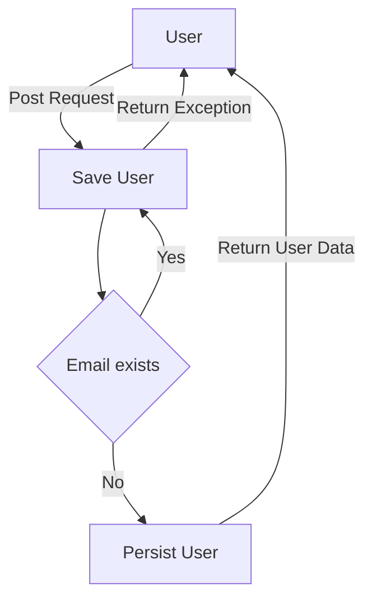

# SmartJob TEST Project

## ¿Qué hace este proyecto?
Este proyecto crea una BD en memoria, la cual contiene dos tablas (users y phones).
También expone 3 endpoints los cuales cumplen las funciones de, agregar usuarios,
buscar un usuario por correo y listar los usuarios registrados.
## ¿Qué necesito para ejecutarlo?
Para ejecutar este proyecto es necesario contar con algún IDE el cuál soporte Java,
en éste caso se utilizó JDK-17 (Se puede utilizar Eclipse, Intellij, etc)
## ¿Cómo lo instalo y configuro?
Para instalar el proyecto es necesario seguiir los siguientes pasos:
1. Descargar el código fuente de este proyecto
2. Abrir el proyecto en un IDE compatible que posea JDK-17
3. Ejecutar el proyecto en el IDE (sólo darle run) 
## ¿Cómo lo uso?
Al correr el proyecto, estará listo para recibir peticiones RestFul
según aparece en la documentación de SWAGGER
## ¿Cómo pruebo que funciona?
Puedes utilizar un navegador o alguna plataforma API como Postman o Bruno,
en éste es posible realizar peticiones al Microservicio

## Diagrama de la Solución

